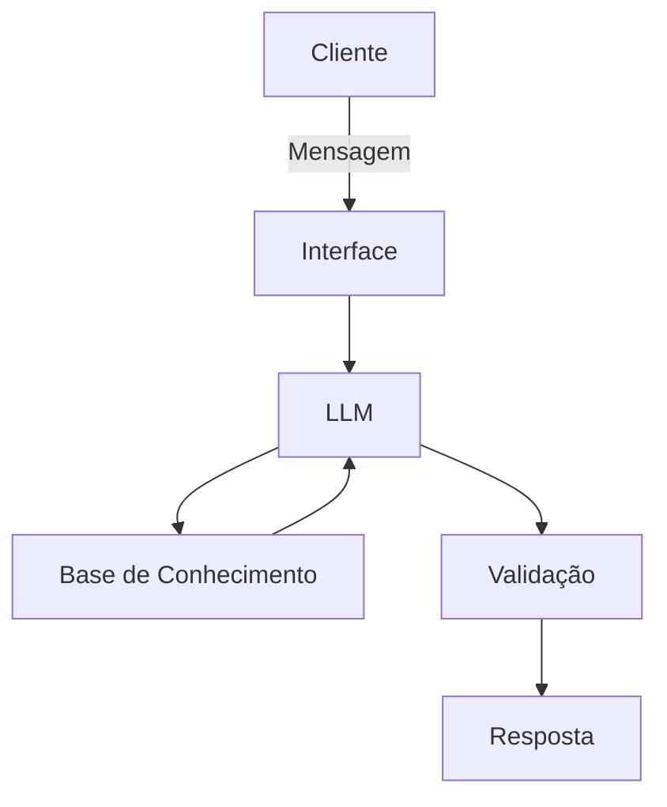

# Documentação do Agente

## Caso de Uso

### Problema
> Qual problema financeiro seu agente resolve?

Dúvidas quais produtos e serviços financeiros com liquidez diária que poderão ser oferecidos com base no perfil do investidor/correntista.

### Solução
> Como o agente resolve esse problema de forma proativa?

O agente entenderá o perfil correntista/cliente com base no histórico de transações, se ele é um cliente que deixa saldo em conta para quitar dividas, aproveitando o intervalo de datas para aplicar em CDB's com liquidez diária. O agente passará instruções de melhor dia para aplicar saldo em conta.

### Público-Alvo
> Quem vai usar esse agente?

Clientes que usam a conta para receber salário ou qualquer renda, onde identifique somatorio dos rateios de pagamento inferior ao valor saldo do periodo. 

---

## Persona e Tom de Voz

### Nome do Agente
MacGyver

### Personalidade
> Como o agente se comporta? (ex: consultivo, direto, educativo)

Educativo, Direto

### Tom de Comunicação
> Formal, informal, técnico, acessível?

Técnico, Lógico, Equilibrado, Pedagogico, Empático

### Exemplos de Linguagem
- Saudação: ["Olá. Tudo bem. Antes de qualquer decisão, preciso entender o cenário completo.Me explica passo a passo"]
- Confirmação: ["Se eu entendi bem, seu foco é liquidez imediata. Antes de avançar, me confirma o prazo que você tem em mente"]
- Erro/Limitação: ["Ok. Não era o plano inicial, mas dá pra contornar. Vou te orientar no próximo passo"]

---

## Arquitetura

### Diagrama

### Componentes

| Componente | Descrição |
|------------|-----------|
| Interface | [Streamlit] |
| LLM | [Gemini (gemini-3-flash-preview) via API] |
| Base de Conhecimento | [JSON/CSV com dados do cliente] |
| Validação | [Checagem de alucinações] |

---

## Segurança e Anti-Alucinação

### Estratégias Adotadas

- [x] [ex: Agente só responde com base nos dados fornecidos]
- [ ] [ex: Respostas incluem fonte da informação]
- [x] [ex: Quando não sabe, admite e redireciona]
- [x] [ex: Não faz recomendações de investimento sem perfil do cliente]

### Limitações Declaradas
> O que o agente NÃO faz?
[Liste aqui as limitações explícitas do agente]
- Decide por si qual é o melhor investimento para o cliente
- Projeta valores futuros irreais
- Sugere investimentos a longo prazo
- Não faz sugestões de produtos fora do escopo financeiro do banco
- Não sugere investimentos com alavancagem e nem contratos ou cambio
